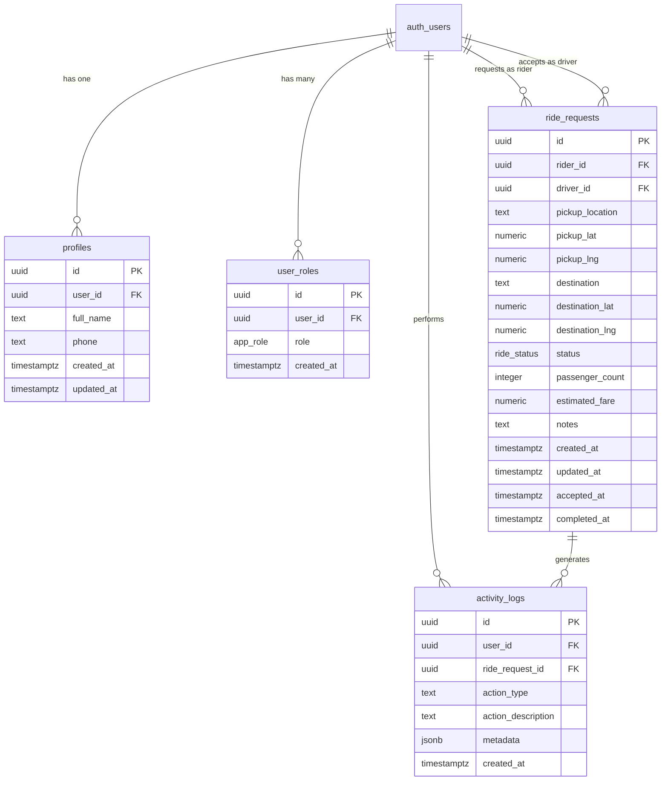

# Database Schema Documentation

## Overview

The application uses Supabase (PostgreSQL) via Lovable Cloud for data persistence. The schema supports ride requests, user management, activity logging, and role-based access control.

---

## Tables

### 1. profiles

**Purpose**: Store additional user information beyond Supabase Auth

| Column | Type | Nullable | Default | Description |
|--------|------|----------|---------|-------------|
| id | uuid | No | gen_random_uuid() | Primary key |
| user_id | uuid | No | - | Reference to auth.users |
| full_name | text | Yes | - | User's display name |
| phone | text | Yes | - | Contact phone number |
| created_at | timestamptz | No | now() | Record creation time |
| updated_at | timestamptz | No | now() | Last update time |

**Constraints**:
- `user_id` is UNIQUE

**RLS Policies**:
```sql
-- Users can view their own profile
CREATE POLICY "Users can view their own profile" 
ON profiles FOR SELECT 
USING (auth.uid() = user_id);

-- Users can insert their own profile
CREATE POLICY "Users can insert their own profile" 
ON profiles FOR INSERT 
WITH CHECK (auth.uid() = user_id);

-- Users can update their own profile
CREATE POLICY "Users can update their own profile" 
ON profiles FOR UPDATE 
USING (auth.uid() = user_id);

-- Admins and employers can view all profiles
CREATE POLICY "Admins and employers can view all profiles" 
ON profiles FOR SELECT 
USING (has_role(auth.uid(), 'admin') OR has_role(auth.uid(), 'employer'));
```

**Note**: DELETE is not allowed on profiles

---

### 2. ride_requests

**Purpose**: Track ride bookings from request to completion

| Column | Type | Nullable | Default | Description |
|--------|------|----------|---------|-------------|
| id | uuid | No | gen_random_uuid() | Primary key |
| rider_id | uuid | No | - | User requesting the ride |
| driver_id | uuid | Yes | - | Assigned driver |
| pickup_location | text | No | - | Pickup address (text) |
| pickup_lat | numeric | Yes | - | Pickup latitude |
| pickup_lng | numeric | Yes | - | Pickup longitude |
| destination | text | No | - | Destination address |
| destination_lat | numeric | Yes | - | Destination latitude |
| destination_lng | numeric | Yes | - | Destination longitude |
| status | ride_status | No | 'requested' | Current status |
| passenger_count | integer | Yes | 1 | Number of passengers |
| estimated_fare | numeric | Yes | - | Calculated fare |
| notes | text | Yes | - | Additional notes |
| created_at | timestamptz | No | now() | Request created |
| updated_at | timestamptz | No | now() | Last update |
| accepted_at | timestamptz | Yes | - | When driver accepted |
| completed_at | timestamptz | Yes | - | When ride completed |

**Status Enum (ride_status)**:
```sql
CREATE TYPE ride_status AS ENUM (
  'requested',
  'accepted', 
  'in_progress',
  'completed',
  'cancelled'
);
```

**RLS Policies**:
```sql
-- Riders can create ride requests
CREATE POLICY "Riders can create ride requests" 
ON ride_requests FOR INSERT 
WITH CHECK (auth.uid() = rider_id);

-- Riders can view their own ride requests
CREATE POLICY "Riders can view their own ride requests" 
ON ride_requests FOR SELECT 
USING (auth.uid() = rider_id);

-- Employees can create ride requests
CREATE POLICY "Employees can create ride requests" 
ON ride_requests FOR INSERT 
WITH CHECK (has_role(auth.uid(), 'employee') AND auth.uid() = rider_id);

-- Employees can view their own ride requests
CREATE POLICY "Employees can view their own ride requests" 
ON ride_requests FOR SELECT 
USING (has_role(auth.uid(), 'employee') AND auth.uid() = rider_id);

-- Drivers can view all requested rides
CREATE POLICY "Drivers can view all requested rides" 
ON ride_requests FOR SELECT 
USING (has_role(auth.uid(), 'driver'));

-- Drivers can update rides they accept
CREATE POLICY "Drivers can update rides they accept" 
ON ride_requests FOR UPDATE 
USING (has_role(auth.uid(), 'driver') AND (driver_id IS NULL OR driver_id = auth.uid()));

-- Employers can view all ride requests
CREATE POLICY "Employers can view all ride requests" 
ON ride_requests FOR SELECT 
USING (has_role(auth.uid(), 'employer'));

-- Admins have full access
CREATE POLICY "Admins have full access to ride requests" 
ON ride_requests FOR ALL 
USING (has_role(auth.uid(), 'admin'));
```

---

### 3. user_roles

**Purpose**: Assign roles to users for access control

| Column | Type | Nullable | Default | Description |
|--------|------|----------|---------|-------------|
| id | uuid | No | gen_random_uuid() | Primary key |
| user_id | uuid | No | - | Reference to auth.users |
| role | app_role | No | - | Assigned role |
| created_at | timestamptz | No | now() | Assignment time |

**Role Enum (app_role)**:
```sql
CREATE TYPE app_role AS ENUM (
  'rider',
  'driver',
  'employer',
  'admin',
  'employee'
);
```

**RLS Policies**:
```sql
-- Users can view their own roles
CREATE POLICY "Users can view their own roles" 
ON user_roles FOR SELECT 
USING (auth.uid() = user_id);

-- Admins can view all roles
CREATE POLICY "Admins can view all roles" 
ON user_roles FOR SELECT 
USING (has_role(auth.uid(), 'admin'));

-- Admins can manage roles
CREATE POLICY "Admins can manage roles" 
ON user_roles FOR ALL 
USING (has_role(auth.uid(), 'admin'));
```

---

### 4. activity_logs

**Purpose**: Track user actions for audit and analytics

| Column | Type | Nullable | Default | Description |
|--------|------|----------|---------|-------------|
| id | uuid | No | gen_random_uuid() | Primary key |
| user_id | uuid | Yes | - | User who performed action |
| ride_request_id | uuid | Yes | - | Related ride request |
| action_type | text | No | - | Type of action |
| action_description | text | No | - | Human-readable description |
| metadata | jsonb | Yes | '{}' | Additional data |
| created_at | timestamptz | No | now() | When action occurred |

**RLS Policies**:
```sql
-- Users can view their own activity
CREATE POLICY "Users can view their own activity" 
ON activity_logs FOR SELECT 
USING (auth.uid() = user_id);

-- Employees can view activity logs related to their rides
CREATE POLICY "Employees can view activity logs related to their rides" 
ON activity_logs FOR SELECT 
USING (
  has_role(auth.uid(), 'employee') AND 
  (user_id = auth.uid() OR ride_request_id IN (
    SELECT id FROM ride_requests WHERE rider_id = auth.uid()
  ))
);

-- Employers can view activity logs
CREATE POLICY "Employers can view activity logs" 
ON activity_logs FOR SELECT 
USING (has_role(auth.uid(), 'employer'));

-- Admins have full access
CREATE POLICY "Admins have full access to activity logs" 
ON activity_logs FOR ALL 
USING (has_role(auth.uid(), 'admin'));
```

---

## Database Functions

### has_role

**Purpose**: Check if a user has a specific role

```sql
CREATE OR REPLACE FUNCTION public.has_role(
  _user_id uuid,
  _role app_role
) RETURNS boolean AS $$
BEGIN
  RETURN EXISTS (
    SELECT 1 
    FROM user_roles 
    WHERE user_id = _user_id 
    AND role = _role
  );
END;
$$ LANGUAGE plpgsql SECURITY DEFINER;
```

**Usage**:
```sql
-- In RLS policy
USING (has_role(auth.uid(), 'admin'))

-- In query
SELECT has_role('user-uuid', 'driver');
```

---

## Entity Relationship Diagram



---

## Common Queries

### Get user's rides
```sql
SELECT * FROM ride_requests 
WHERE rider_id = auth.uid() 
ORDER BY created_at DESC;
```

### Get user profile with roles
```sql
SELECT 
  p.*,
  array_agg(ur.role) as roles
FROM profiles p
LEFT JOIN user_roles ur ON ur.user_id = p.user_id
WHERE p.user_id = auth.uid()
GROUP BY p.id;
```

### Get pending rides for drivers
```sql
SELECT * FROM ride_requests 
WHERE status = 'requested'
AND driver_id IS NULL
ORDER BY created_at ASC;
```

### Get ride statistics for employer
```sql
SELECT 
  COUNT(*) as total_rides,
  COUNT(*) FILTER (WHERE status = 'completed') as completed,
  COUNT(*) FILTER (WHERE status = 'cancelled') as cancelled,
  AVG(estimated_fare) as avg_fare
FROM ride_requests
WHERE created_at > NOW() - INTERVAL '30 days';
```

### Log an activity
```sql
INSERT INTO activity_logs (user_id, ride_request_id, action_type, action_description, metadata)
VALUES (
  auth.uid(),
  'ride-uuid',
  'ride_requested',
  'User requested a ride to FedEx Distribution Center',
  '{"pickup": "Midtown Hub", "destination": "FedEx"}'::jsonb
);
```

---

## Security Notes

1. **RLS is enabled on all tables** - No public access without authentication
2. **Role-based access** - Different roles have different permissions
3. **User isolation** - Users can only see their own data (except admins/employers)
4. **Sensitive data** - No PII stored beyond profile basics
5. **Audit trail** - Activity logs track all significant actions

---

## Future Schema Considerations

### Potential Tables
- `routes` - Store predefined transportation routes
- `schedules` - Route schedules and frequencies
- `vehicles` - Fleet management
- `employers` - Employer organization data
- `payments` - Transaction records
- `subscriptions` - Pass/subscription tracking
- `ratings` - Driver and ride ratings

### Potential Columns
- `ride_requests.employer_id` - For employer-sponsored rides
- `ride_requests.route_id` - Link to predetermined routes
- `profiles.employer_id` - Link employees to employers
- `profiles.employee_code` - For employee discount validation
