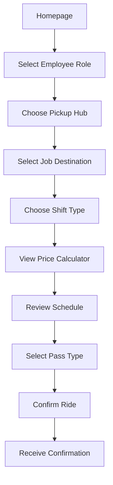
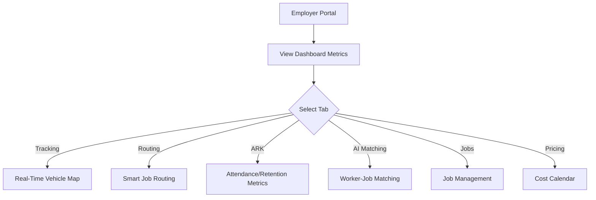
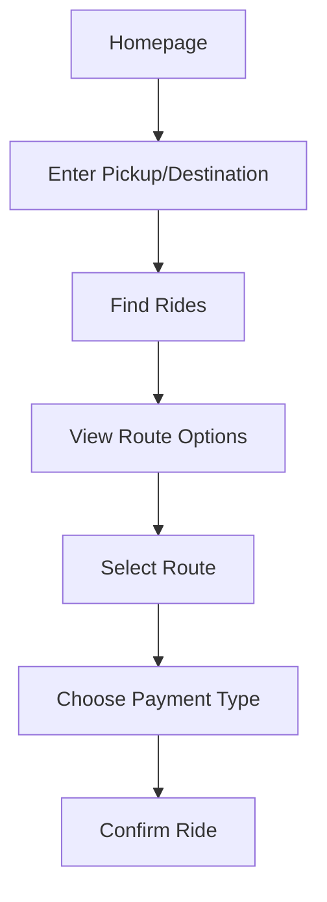

# Routes & Jobs - Complete System Documentation

## Overview

Routes & Jobs is a workforce transportation and job-matching platform focused on Memphis, TN. The application connects workers with affordable transportation to employment centers while enabling employers to manage workforce logistics.

## Core Value Proposition

**ARK - Affordable, Reliable, Keeps Moving**

- **Affordable**: Rides starting at $1.50 (up to 70% less than traditional rideshare)
- **Reliable**: 94.2% on-time arrival rate with guaranteed pickup windows
- **Keeps Moving**: Continuous service with shared routes and optimized scheduling
- **No Surge Pricing**: Flat-rate, predictable costs for workers

---

## User Roles & Personas

### 1. Employee (Worker)
**Goal**: Find reliable, affordable transportation to work

**Key Features**:
- Schedule rides to job sites
- View flat-rate pricing ($35/week, $120/month passes)
- Browse job listings with guaranteed transportation
- Select from predefined pickup hubs and job destinations

**Entry Points**:
- Homepage → "Get a Ride" → General Public Flow
- Homepage → "Find a Job" → Job Listings
- Employee Flow via role selection

### 2. Employer
**Goal**: Manage workforce transportation and reduce absenteeism

**Key Features**:
- Dashboard with transportation metrics (on-time rate, active routes, savings)
- Real-time vehicle tracking
- Route management with pickup hubs
- AI-powered worker-job matching
- ARK metrics tracking (Attendance, Retention, Key Performance)
- Pricing calendar for cost planning

**Entry Points**:
- Homepage → "Employer Portal" → Employer Dashboard

### 3. General Public (Community Rider)
**Goal**: Access affordable community transportation

**Key Features**:
- Request rides with address autocomplete
- Choose from multiple route options (Employee Discount, Shuttle, Community)
- Access jobs with guaranteed transportation
- Subscribe to weekly/monthly passes

**Entry Points**:
- Homepage ride booking widget
- Homepage → "Get a Ride"

### 4. Driver
**Goal**: Manage routes and track performance

**Key Features**:
- Active route management
- Traffic condition monitoring
- GPS navigation integration
- Performance metrics (routes completed, ratings, earnings)
- Priority-based route scheduling

**Entry Points**:
- Homepage → "Driver Login" → Driver App (/driver)

---

## Application Architecture

```
┌─────────────────────────────────────────────────────────────────┐
│                        App.tsx (Router)                          │
├─────────────────────────────────────────────────────────────────┤
│  Providers: QueryClient, Tooltip, Language, Toast                │
└───────────────────────────┬─────────────────────────────────────┘
                            │
    ┌───────────────────────┼───────────────────────┐
    │                       │                       │
    ▼                       ▼                       ▼
┌─────────┐          ┌─────────────┐         ┌───────────┐
│  Index  │          │  /driver    │         │  /mapping │
│  (/)    │          │  DriverApp  │         │ MappingIdx│
└────┬────┘          └─────────────┘         └───────────┘
     │
     ▼
┌───────────────────────────────────────────────────────────────┐
│                     RoleSelection                              │
│  ┌─────────────┐  ┌─────────────┐  ┌─────────────┐           │
│  │EmployeeFlow │  │EmployerFlow │  │GeneralPublic│           │
│  │             │  │             │  │    Flow     │           │
│  └─────────────┘  └─────────────┘  └─────────────┘           │
└───────────────────────────────────────────────────────────────┘
```

---

## Page Routes

| Route | Component | Description |
|-------|-----------|-------------|
| `/` | Index → RoleSelection | Landing page with role selection |
| `/jobs` | SimpleJobListings | Standalone job listings page |
| `/driver` | DriverApp | Driver dashboard and route management |
| `/employee-locations` | EmployeeLocations | Employee drop-off location selector |
| `/mapping` | MappingIndex | Memphis map with routes visualization |

---

## Key Workflows

### Workflow 1: Employee Booking a Ride



### Workflow 2: Employer Managing Routes



### Workflow 3: General Public Ride Request



---

## Pricing Structure

### Individual Rides
| Type | Price | Notes |
|------|-------|-------|
| Workplace Shuttle | $1.50 | Shared service to employment areas |
| Employee Discount | $2.75 | 50% off with work ID (was $5.50) |
| Community Ride | $3.25 | Standard community transportation |

### Subscription Passes
| Pass Type | Price | Benefits |
|-----------|-------|----------|
| Weekly Pass | $35 | Unlimited rides for 7 days, priority scheduling |
| Monthly Pass | $120 | Unlimited rides for 30 days, emergency ride credits |

### Employer Pricing
- Routes are managed per-employee basis
- Bulk discounts available for workforce transportation
- ROI tracking through ARK metrics

---

## Memphis Focus Area

### Employment Centers
- FedEx Distribution Center
- Amazon Fulfillment Center
- AutoZone Distribution Center
- Memphis Medical Center
- Manufacturing Plants
- Industrial Parks

### Pickup Hubs
- Midtown Hub
- Downtown Hub
- East Memphis Hub
- South Memphis Hub
- Airport Hub
- Wolfchase Galleria
- Shelby Farms Park

---

## State Management

### Global Contexts

1. **LanguageContext** (`src/contexts/LanguageContext.tsx`)
   - Supports: English, Spanish, French, German
   - Provides `t()` translation function
   - Used throughout UI for internationalization

2. **RouteContext** (`src/contexts/RouteContext.tsx`)
   - Manages selected route state for mapping
   - Provides `selectRoute()` and `clearRoute()` functions
   - Used by MapSelector and LeafletMap components

### Component-Level State
- Each flow component (EmployeeFlow, EmployerFlow, GeneralPublicFlow) manages its own:
  - Step progression (request → schedule → subscription)
  - Form data (pickup, destination, passengers, etc.)
  - Active tab selection

---

## Integration Points

### Backend (Lovable Cloud / Supabase)

**Tables**:
- `profiles` - User profile information
- `ride_requests` - Ride booking records with status tracking
- `user_roles` - Role assignments (rider, driver, employer, admin, employee)
- `activity_logs` - User action tracking

**RLS Policies**:
- Role-based access control
- Users can only view/modify their own data
- Admins and employers have broader access

### Mapping
- Leaflet with OpenStreetMap tiles
- No API key required
- Custom markers for employment centers and pickup hubs
- Route visualization with Leaflet Routing Machine

---

## Technology Stack

| Category | Technology |
|----------|------------|
| Framework | React 18 |
| Build Tool | Vite |
| Language | TypeScript |
| Styling | Tailwind CSS |
| UI Components | shadcn/ui |
| Maps | Leaflet + React-Leaflet |
| State Management | React Context + useState |
| Data Fetching | TanStack Query |
| Backend | Supabase (via Lovable Cloud) |
| Routing | React Router DOM |
| Forms | React Hook Form + Zod |
| Charts | Recharts |
| Animations | CSS + Tailwind |

---

## File Structure

```
src/
├── components/
│   ├── ui/                    # shadcn/ui components
│   ├── maps/                  # Map-related components
│   ├── EmployeeFlow.tsx       # Employee ride booking flow
│   ├── EmployerFlow.tsx       # Employer dashboard
│   ├── GeneralPublicFlow.tsx  # Public ride requests
│   ├── RoleSelection.tsx      # Homepage role selection
│   ├── JobListings.tsx        # Job listing component
│   ├── MapSelector.tsx        # Map display with controls
│   └── ...
├── contexts/
│   ├── LanguageContext.tsx    # i18n support
│   └── RouteContext.tsx       # Route selection state
├── data/
│   ├── memphisPOIdata.ts      # Memphis locations data
│   └── predeterminedRoutes.ts # Route definitions
├── pages/
│   ├── Index.tsx              # Homepage
│   ├── DriverApp.tsx          # Driver dashboard
│   ├── SimpleJobListings.tsx  # Standalone job page
│   ├── MappingIndex.tsx       # Map visualization page
│   └── ...
├── hooks/
│   ├── use-toast.ts           # Toast notifications
│   └── use-mobile.tsx         # Mobile detection
└── integrations/
    └── supabase/              # Backend client & types
```
